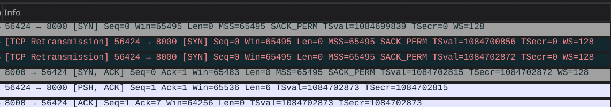

uring doesn't work on podman, so use colima instead

to run, execute run.sh and choose the variant
1. blocking
```bash
./run.sh blocking
```

2. epoll
```bash
./run.sh epoll
```

3. uring
```bash
./run.sh uring
```

stuffs to write about:

1. exceeding the kernel's write buffer. your write() gets blocked until the client calls read()
   cat /proc/sys/net/ipv4/tcp_rmem
   cat /proc/sys/net/ipv4/tcp_wmem

   check the current buffer length by inspectig the Send-Q and Recv-Q value of
   ss -tulpna

   I want to find an exact threshold for this rather than just a "big number" but that doesn't seem possible since modern kernels auto tunes the value. Or maybe just my skill issue

   Also the native net.conn implementation suffers from the same issue,
   but it appears to only manifest at a way higher payload though.

2. Is it possible for a closed TCP connection to be reopened if a packet arrives after FIN?
   No it isn't actual problem is number 3

3. Syn retransmission triggers two network connections?
   2025/06/27 19:25:32 got new connection from port 56424: allocating to fd 45
   2025/06/27 19:25:32 got new connection from port 56424: allocating to fd 18

   

   Okay, this only happens if your listen.2 backlog is too small!

4. Raw vs non raw syscalls in go and how it relates to the scheduler. Very fun.
   https://stackoverflow.com/questions/16977988/details-of-syscall-rawsyscall-syscall-syscall-in-go

also, there is something called the TCP simultaneuous open. Rare and obscure though.
